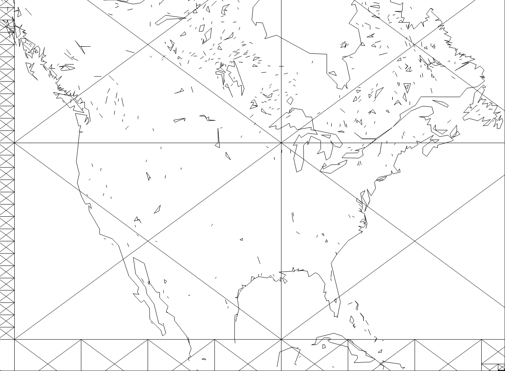

# Coastline-Paradox

This is a web app to view the world map from GSHHG data. This project is purely for learning, and is a very small subset of any commercial map application. 

Only tested on desktop, no mobile support.

## Controls

- **Zoom**: scroll or use the mouse wheel
- **Pan**: drag the map or use the arrow keys

## Resources
- https://webglfundamentals.org/webgl/lessons/webgl-fundamentals.html
- https://blog.mapbox.com/how-i-built-a-wind-map-with-webgl-b63022b5537f
- http://www.soest.hawaii.edu/pwessel/gshhg/

## Technical Details

### Chunking

The map is split into a grid of chunks. The chunking is a recursive process. Each chunk is split into four sub-quadrants, and so on, until each chunk contains less than 200 lines.

When querying data, we only need to query the chunks in the current viewport.

The chunk name is the sequence of quadrants to the root chunk. For example, the chunk name for the chunk at the bottom right corner is "1". Its sub-chunks are "11", "12", "13", "14".

Preprocessing is done in Python. For full resolution data it can take 20 minutes.

### Resolutions

GSHHG provides 5 map resolutions. Each resolution is chunked separately. Chunk names are prefixed with the resolution, e.x. "f1432" for a full resolution chunk.

### Database

Firebase Realtime Database is used as a key-value store. The key is the chunk name, and the value is the lines that intersect the chunk.

To get all lines that intersect a chunk, we can query the database for all chunks lexicographically between the chunk name and the next chunk. For example, to get all lines that intersect chunk "f12", we can query the database for all chunks between "f12" and "f13". This includes subchunks like "f1211", "f1212", "f1213", "f1214".

If we query a chunk that does not exist, we can get its parent chunk by querying the database for the chunk lexographically before the chunk name. For example, to get the parent of "f1214", we query for the first chunk before "f1214". This might return "f12" or "f121".

By taking advantage of lexical ordering, we avoid the need for a server to process queries.

### Rendering

Each frame, we determine the resolution to render based on the zoom level. Then all lines in the cache at that resolution are rendered. Rendering is done with simple WebGL.

### Performance

The app runs at a smooth 60fps on a M1 Macbook Air. The data usage is somewhat high, downloading a few MB of data in a typical session. There is probably around an order of magnitude to be saved in data usage by inserting a server for smarter queries and compressing the data.